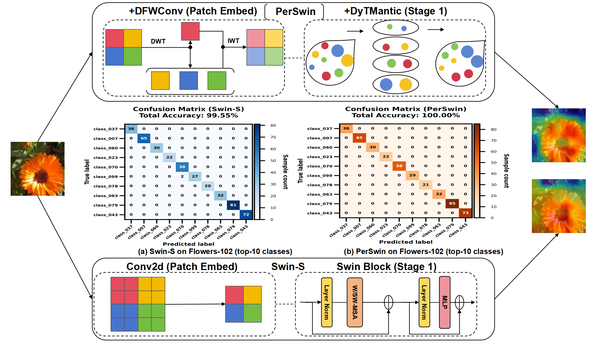
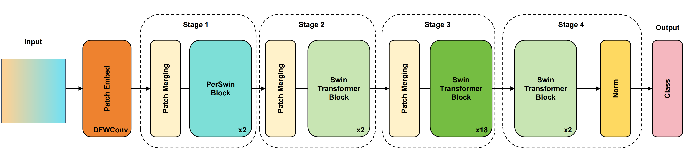

# PerSwin: A Frequency-aware Swin Transformer with Semantic Enhancement for Image Classification

<div align="center">
  
</div>

---

## News
- **[2026-04-16]** Initial release of the code and paper submission. (Note: The core model source code file will be released shortly after the paper is accepted.)

## Introduction
<div align="center">
  
  <br>
  <em>Figure 1: The overall architecture of the PerSwin framework.</em>
</div>

### Key Contributions

1. **DFWConv (frequency-aware patch embedding module)**
   - It helps retain detail information that standard spatial tokenization often weakens.

2. **DyTMantic (semantic enhancement module)**
   - It reinforces local contextual representation without adding much parameter cost.

## Trained

| Model | Dataset | Acc (%) | log | fig |
| :--- | :--- | :---: | :--- |:--- |
| Swin | CIFAR-10   | 98.40 | [log](./log/Swin-S_CIFAR-10_98.4%25-2026_4_17%2021_13_15.txt) | [fig](./fig/Swin-S_CIFAR-10_98.4.png) |
| Swin | CIFAR-100  | 87.96 | [log](./log/Swin-S_CIFAR-100_87.96%25-2026_4_17%2021_13_17.txt) | [fig](./fig/Swin-S_CIFAR-100_87.96.png) |
| Swin | Flowers-102| 93.26 | [log](./log/Swin-S_Flowers102_93.26%25-2026_4_17%2021_13_37.txt) | [fig](./fig/Swin-S_Flowers102_93.26%25.png) |
| Swin | FER-2013   | 73.05 | [log](./log/Swin-S_FER-2013_73.05%25-2026_4_17%2021_13_02.txt) | [fig](./fig/Swin-S_FER-2013_73.05%25.png) |
| PerSwin | CIFAR-10   | 98.69 | [log](./log/PerSwin_CIFAR-10_98.69%25-2026_4_17%2021_13_20.txt) | [fig](./fig/PerSwin_CIFAR-10_98.69.png) |
| PerSwin | CIFAR-100  | 88.46 | [log](./log/PerSwin_CIFAR-100_88.46%25-2026_4_17%2021_13_22.txt) | [fig](./log/PerSwin_CIFAR-100_88.46%25-2026_4_17%2021_13_22.txt) |
| PerSwin | Flowers-102| 94.29 | [log](./log/PerSwin_Flowers102_94.29%25-2026_4_17%2021_13_34.txt) | [fig](./fig/PerSwin_Flowers102_94.29%25.png) |
| PerSwin | FER-2013   | 73.47 | [log](./log/PerSwin_FER-2013_73.47%25-2026_4_17%2021_12_52.txt) | [fig](./fig/PerSwin_FER-2013_73.47%25.png) |

### Data Preparation

Download the datasets and structure them as follows:
```
data/
├── Flowers102/
│   ├── train/
│   │   ├── class_000/
│   │   └── ...
│   └── test/
│       ├── class_000/
│       └── ...
└── ...
```

## Acknowledgement

This project is built upon Swin Transformer. We thank the authors for their great work and open-source contributions.

## Citing Swin Transformer

```bibtex
@inproceedings{liu2021Swin,
  title={Swin Transformer: Hierarchical Vision Transformer using Shifted Windows},
  author={Liu, Ze and Lin, Yutong and Cao, Yue and Hu, Han and Wei, Yixuan and Zhang, Zheng and Lin, Stephen and Guo, Baining},
  booktitle={Proceedings of the IEEE/CVF International Conference on Computer Vision (ICCV)},
  year={2021}
}
```
